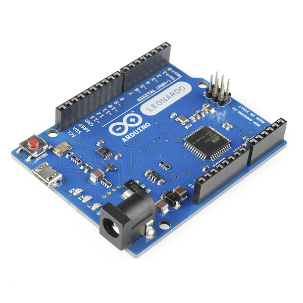
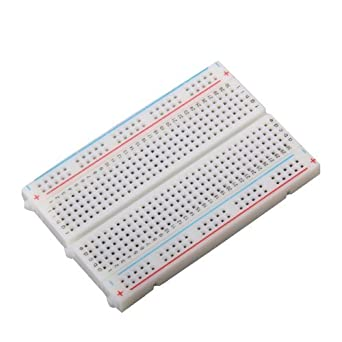
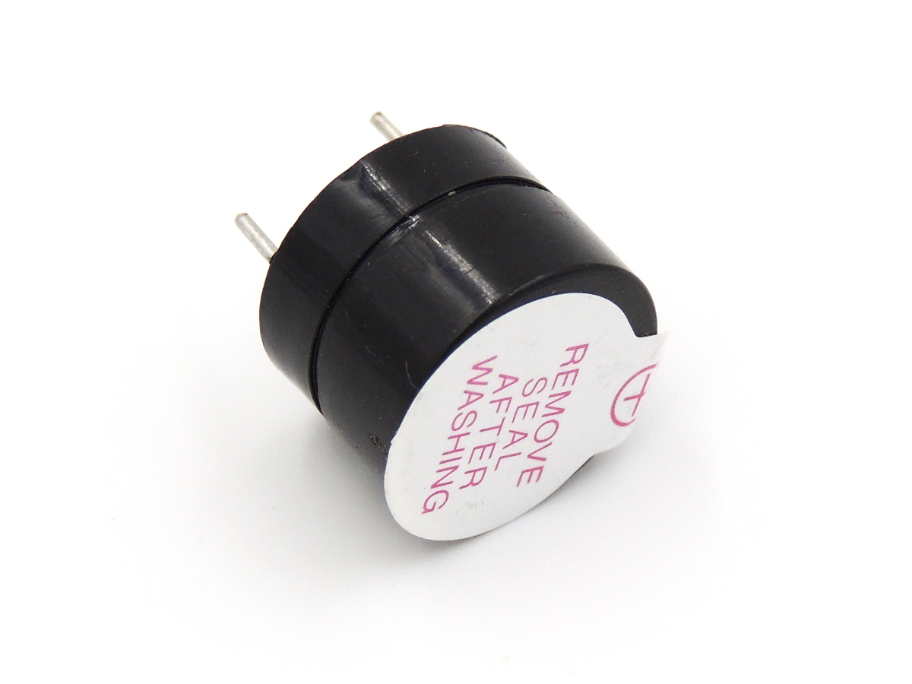
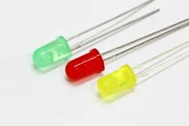
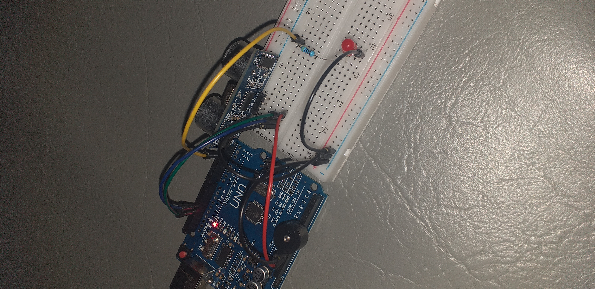

# Arduino เซ็นเซอร์วัดระยะทาง
อุปกรณ์ที่ใข้
1. Arduino Uno
2. Breadboard
3. หลอดไฟlED
4. Buzzer 

     

โครงร่าง

ตัวต้นแบบ

     
##Story
โครงการชิ้นนี้ทำเพื่อแจ้งเตือน เพื่อช่วยผู้ปกครองที่มีรถ แล้วบุตรหลานเวลาที่จะถอยรถ จะยากลำบาก ถ้าไม่เห็นของหลังหรือ คนที่ตัวสูงเช่น เด็กๆ ที่อยู่หลังรถอาจจะทำให้เกิดอุบัติเหตุขึ้นได้

ประโยชน์ที่จะได้รับจากโครงงานนี้คือ สามารถแจ้งเตือนผู้ปกครองเวลาถอยรถเข้าบ้านเมือมี เด็ก หรือ วัตถุ อยู่ใกล้ ในโปรแกรมนี้จะยกตัวอย่างที่อยู่ใกล้น้อยกว่า 50 เซนติเมตรจะแจ้งส่งเสียงแจ้งเตือนแล้มีไฟสว่างขึ้นมาถ้าอยู่ใล้กวา 50 เซนติ

ลิงด์code
(https://github.com/honnage/Arduino_LightSensor/blob/master/Light_sensor.ino)

ลิงด์วิดีโอ
(https://youtu.be/sr7_FshxCuU)

จัดทำโดย
นายภาสกร โพธิืใหญ่ 60160305
